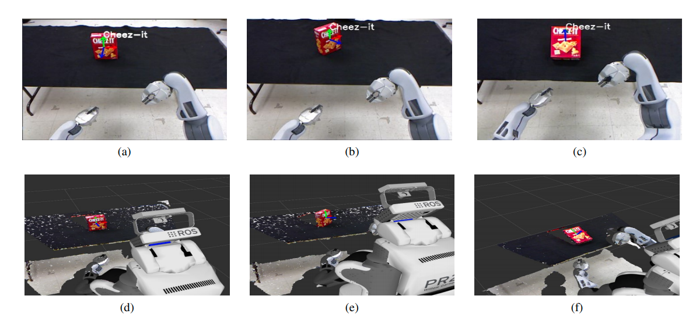

# Planar Pose Estimation

[](https://www.codefactor.io/repository/github/paul-shuvo/planar_pose)
[](https://www.travis-ci.com/paul-shuvo/planar_pose)

__Note:__ `sudo apt install ros-noetic-tf-conversions` before installing it

following is an important image 


[crocos_installation](https://github.com/orocos/orocos_kinematics_dynamics/blob/master/python_orocos_kdl/INSTALL.md)

[image_issue](https://github.com/orocos/orocos_kinematics_dynamics/issues/115)

## Table of contents
- [Planar Pose Estimation](#planar-pose-estimation)
  - [Table of contents](#table-of-contents)
    - [Dependencies](#dependencies)
    - [Install](#install)
    - [Run](#run)
    - [Topics](#topics)
    - [Demo](#demo)
    - [Citation](#citation)

### Dependencies

- ROS Indigo/Jade/Melodic/Noetic
- OpenCV (Tested on opencv 4, should work with other opencv versions as well)

### Install
For new projects:

```
mkdir catkin_ws/src
cd catkin_ws/src
git clone https://github.com/paul-shuvo/planar_pose.git
cd planar_pose
pip install -r requirements.txt
cd ../../..
catkin_make
```

For existing project:

```
cd 'your_project_path'/src
git clone https://github.com/paul-shuvo/planar_pose.git
cd planar_pose
pip install -r requirements.txt
cd ../../..
catkin_make
```

### Run

This package contains a object detection module and a planar pose estimation module. Planar pose estimation module depends on the object detection module.

To run the object detection module:
```
cd 'your_project_path`
source devel/setup.bash
rosrun planar_pose object_detection.py
```

Then, to run the planar pose estimation module: 
```
cd 'your_project_path`
source devel/setup.bash
rosrun planar_pose planar_pose_estimation.py
```

### Topics

 - `/detected_object`
    Coordinates of the boundary of the detected objects in terms of a json string. 
    ```json
    ---
    "data: {\"cheezeit\": [[369, 252], [367, 344], [423, 339], [429, 251]], \"book-1\": [[518, 234],\
    \ [525, 225], [513, 230], [590, 222]]}"
    ---
    ```
 - `/object_pose_info`
    Pose (Quaternion) info of the detected objects in terms of a json string.
    ```json
    ---
    data: "{\"cheezeit\": {\"position\": [-0.21074476838111877, 0.17126992344856262, 1.377000093460083],\
    \ \"orientation\": [-0.7785678371108322, -0.03650856877418329, 0.6243951877330678,\
    \ 0.05128252098335612]}, \"book-1\": {\"position\": [0.10074007511138916, 0.07484704256057739,\
    \ 0.8750000596046448], \"orientation\": [-0.99671235271185, -0.024004214965333632,\
    \ -0.05656042965190621, 0.052812890595937564]}}"
    ---
    ```
 - `/object_pose_array`
    PoseArray of the detected objects.
    ```yaml
    ---
    header: 
        seq: 9
        stamp: 
            secs: 1612235248
            nsecs: 180106401
        frame_id: "kinect2_rgb_optical_frame"
    poses: 
      - 
        position: 
            x: -0.3775361180305481
            y: 0.18009251356124878
            z: 1.2940000295639038
        orientation: 
            x: -0.8238780569888
            y: -0.005098909875330737
            z: 0.5370874941853346
            w: 0.1809308484481323
        - 
        position: 
            x: 0.04039544239640236
            y: 0.06119309365749359
            z: 0.8650000691413879
        orientation: 
            x: -0.997179603918241
            y: -0.036229147670746836
            z: -0.0050051373858676085
            w: 0.06553804229804013
    ---
    ```

### Demo


(a),(b),(c) are recovered poses from robot’s camera and (d),(e),(f) are corresponding poses visualized in RViz



### Citation

Please cite these papers in your publications if it helps your research:

```bibtex
@inproceedings{paul2020object,
      title={Object Detection and Pose Estimation from RGB and Depth Data for Real-time, Adaptive Robotic Grasping}, 
      author={S. K. Paul and M. T. Chowdhury and M. Nicolescu and M. Nicolescu},
      booktitle={Proceedings of the International Conference on Image Processing, Computer Vision, and Pattern Recognition (IPCV)}
      year={2020},    
}
```

